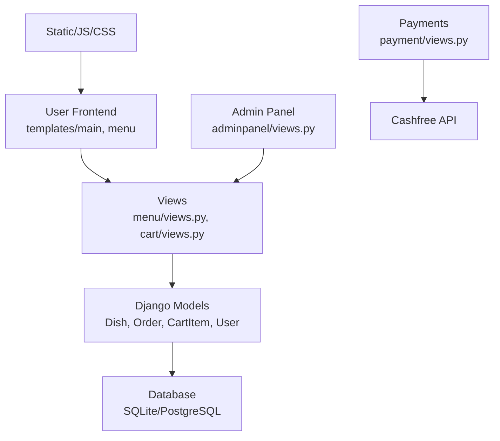
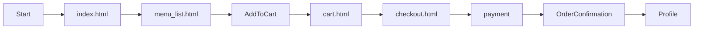
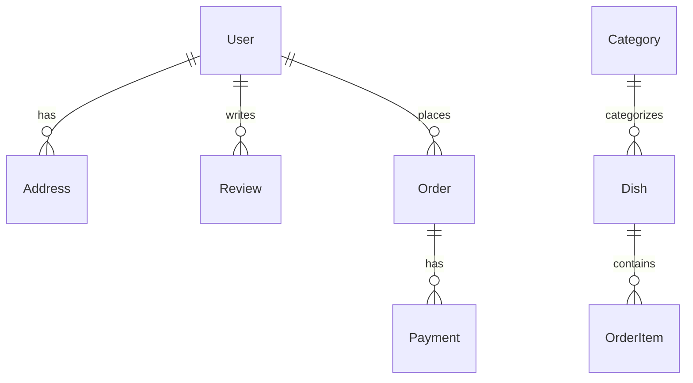

# ZaikaX 🥘 - Indian Restaurant Web App

[](https://opensource.org/licenses/MIT)
[](https://www.python.org/)
[](https://www.djangoproject.com/)

**ZaikaX** is a full-stack Django-powered web application for an Indian restaurant. Customers can browse menus, add to cart, checkout with payments (Cashfree), and admins manage dishes/orders.

 <!-- Replace with screenshot -->

## ✨ Features

| Feature | Description |
|---------|-------------|
| **User Auth** | Registration, login, profiles, addresses |
| **Menu Browsing** | Dish catalog with images, mood selector, AI recommendations |
| **Shopping Cart** | Add/remove items, checkout flow |
| **Payments** | Cashfree integration for orders |
| **Admin Panel** | Dashboard, add/edit dishes, view orders/users |
| **Interactive UI** | Chatbot, 3D menu icons, reviews slider, spotlight effects |
| **Reviews & FAQs** | User reviews, FAQ section |
| **Seeding** | Menu & orders seed scripts |

## 🛠 Tech Stack

| Category | Technologies |
|----------|--------------|
| Backend | Django 5.0, SQLite/PostgreSQL |
| Frontend | HTML, Bootstrap?, Custom CSS/JS (chatbot, reviews.js, spotlight.js) |
| Payments | Cashfree PG |
| Media | Pillow for images |
| Interactive | Vanilla JS (app.js, three_menu_icon.js) |

## 🏗 Architecture



## 📋 User Flow



## 🗄 Database Schema (Simplified)



## 🚀 Quick Start

### Prerequisites
- Python 3.10+
- Git

### Setup
```bash
git clone <repo-url>
cd ZaikaX_Capstone
python -m venv venv
# Windows: venv\\Scripts\\activate
# macOS/Linux: source venv/bin/activate
pip install django pillow  # Full reqs in requirements.txt
python manage.py migrate
python seed_menu.py
python cart/seed_orders.py
python manage.py createsuperuser
python manage.py runserver
```

Visit `http://127.0.0.1:8000`

**Payments:** Edit `ZaikaX/settings.py`:
```python
CASHFREE_API_KEY = "your_key"
CASHFREE_APP_ID = "your_id"
```

### Admin
`/admin/` - Login as superuser.

### Seeding
- `seed_menu.py`: Populates dishes
- `cart/seed_orders.py`: Sample orders

## 📸 Screenshots

| Home Page | Menu | Cart | Admin Dashboard |
|-----------|------|------|-----------------|
|  |  |  |  |

## 🚀 Deployment
- **Heroku/Render:** `gunicorn ZaikaX.wsgi`, PostgreSQL
- **Nginx/Gunicorn** for prod
- Env vars for secrets/DB
- Media: AWS S3 or similar

## 🤝 Contributing
See [CONTRIBUTING.md](CONTRIBUTING.md)

## 📄 License
MIT - See [LICENSE](LICENSE)

## 🛡️ Security
See [SECURITY.md](SECURITY.md)

---

⭐ Star us on GitHub! Questions? Open an issue.
